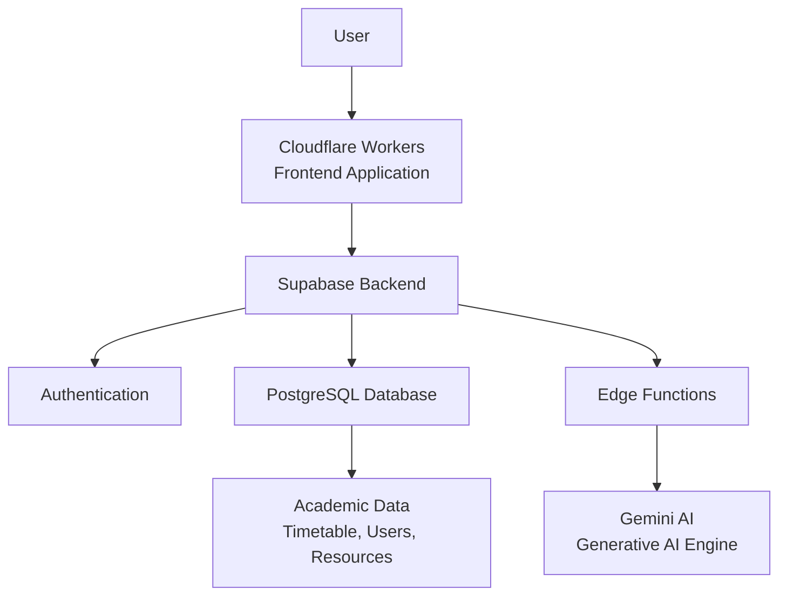

# 🚀 SmartClass

## AI-Powered Classroom Management Platform

SmartClass is an AI-powered classroom management platform designed to optimize academic scheduling, reduce administrative workload, and make classroom operations smarter, simpler, and more efficient.

Built during the **Build with AI Solution Challenge 2026**, SmartClass combines Generative AI, modern web technologies, and cloud infrastructure to solve real-world challenges faced by educational institutions.

---

## 📌 Problem Statement

Managing academic schedules manually is a complex and time-consuming process.

Educational institutions often face challenges such as:

- ❌ Classroom scheduling conflicts
- ❌ Faculty timetable clashes
- ❌ Uneven workload distribution among faculty members
- ❌ Inefficient utilization of available classrooms
- ❌ Scattered academic data stored across multiple spreadsheets
- ❌ Difficulty in making quick scheduling decisions

Traditional ERP systems often rely on static data and manual updates, making real-time coordination difficult.

---

# 💡 Our Solution

SmartClass provides a centralized intelligent platform that helps institutions manage academic planning efficiently.

It acts as a **single source of truth** for administrators, faculty, and students by combining scheduling automation, AI assistance, and centralized data management.

---

# ✨ Key Features

## 🤖 AI-Powered Academic Assistant

- Gemini-powered AI assistant for intelligent classroom support
- Helps analyze scheduling requirements
- Provides suggestions and recommendations
- Assists users in making better academic decisions

## 📅 Smart Timetable Management

- Intelligent timetable planning
- Conflict-aware scheduling
- Prevents overlapping faculty assignments
- Helps optimize classroom utilization

## ⚡ Real-Time Conflict Detection

SmartClass identifies:

- Classroom conflicts
- Faculty scheduling clashes
- Resource allocation issues

Instead of discovering problems later, users can identify conflicts instantly.

## 👩‍🏫 Faculty Workload Management

- Provides workload visibility
- Helps prevent faculty overload
- Enables better distribution of teaching responsibilities

## 🏫 Classroom Optimization

- Capacity-aware classroom allocation
- Better utilization of available resources
- Reduces unnecessary scheduling conflicts

## 🔐 Secure User Management

- Authentication system
- Personalized access
- Multi-role architecture for different users

## 📊 Centralized Data Management

- Replaces fragmented spreadsheets
- Provides a secure database-driven system
- Maintains consistent academic information across users

## 📱 Modern Responsive Interface

- Clean and intuitive UI
- Responsive design across devices
- Improved user experience

---

# 🚀 What Makes SmartClass Different?

Unlike traditional ERP systems that rely on static spreadsheets:

### ⚡ Real-Time Conflict Awareness
SmartClass detects scheduling issues dynamically instead of depending on manual checking.

### 🤖 AI-Driven Optimization
Generative AI helps users analyze situations and make smarter decisions.

### 🔍 Single Source of Truth
All users access consistent and centralized academic information.

### 👥 Multi-Role Architecture
Designed to support different user needs with personalized access.

### ☁️ Cloud-Based Scalable Architecture
Built using modern cloud technologies for accessibility and scalability.

---

# 🛠️ Technology Stack

## Frontend

- React / TanStack Start
- Vite
- Modern responsive UI components

## Backend

- Supabase
- PostgreSQL Database
- Authentication
- Edge Functions

## Artificial Intelligence

- Google Gemini
- Generative AI integration

## Deployment

- Cloudflare Workers
- Supabase Cloud

---

# 🏗️ System Architecture

👉 Deployed on Cloudflare Page :

https://tanstack-start-app.smartclass-app.workers.dev

⚡Demo video : 

https://youtu.be/hmuaQUeWbrk?si=6Dre84KteZdPbmWN

🏆 Achievement

Built for:

Google Solution Challenge 2026
Build with AI

Powered by:

Hack2Skill

👥 Team

Built by:

Anushka Singh
Akansha Kushwaha

🧩 Previous Deployment Note :
A previous deployment attempt using Vercel was unsuccessful and has been deprecated. The project is now fully hosted on Cloudflare Pages.
